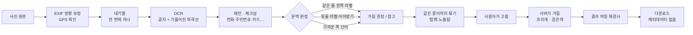

<div align="center">

# Privacy Lens · 프라이버시 렌즈

**공유하기 전에, 배경까지 한 번 더.**

사진 뒤쪽에 찍힌 택배 송장·학생증·모니터 속 개인정보를 찾아<br>
**어디에, 무엇이, 왜** 문제인지 보여 주고, 고른 곳만 가린 사본을 만들어 줍니다.

수원대학교 정보보호학과 · 시스템보안프로젝트 · 2026-2 · 5인 팀


</div>


---

## 한눈에

| | |
|---|---|
| **찾는 것** | 이름(라벨 뒤) · 휴대전화/유선 · 이메일 · 도로명주소 · 동·호수 · 주민등록번호 · 카드번호 · 운송장번호 · 차량번호 · QR/바코드 · 사진 속 GPS |
| **알려 주는 것** | 항목마다 **가림 권장 / 검토 권장 / 참고**, 왜 그렇게 봤는지(“'연락처' 주변에서 휴대전화번호가 인식됨”), 같은 종이에서 함께 나온 정보 |
| **하지 않는 것** | 점수 매기기, 못 읽은 글자 지어내기, 자동으로 가려서 올리기. 무엇을 가릴지는 사용자가 정합니다 |
| **남기지 않는 것** | 사진은 분석·저장할 때만 서버로 가고, 디스크·로그·DB 어디에도 남지 않습니다 |

<table>
<tr>
<td width="50%"></td>
<td width="50%"></td>
</tr>
<tr>
<td align="center"><b>전후 비교</b> — 미리보기도 서버가 실제로 가린 모습</td>
<td align="center"><b>저장</b> — 결과 파일을 다시 검사한 뒤 내려받기</td>
</tr>
</table>

---

## 3분 만에 실행

```bash
git clone https://github.com/2026-usw-project/privacy-lens.git
cd privacy-lens
pip install -r requirements.txt
pip install paddleocr "paddlepaddle<3.3"     # 기본 OCR
```

```bash
python run.py                              # 모든 운영체제에서 PaddleOCR 기본 사용
```

→ **http://127.0.0.1:8000** — 화면과 API 가 한 주소에서 나옵니다.

- `run.py` 가 먼저 환경을 점검하고, 빠진 것이 있으면 운영체제에 맞는 설치 방법을 알려 준 뒤 멈춥니다. 점검만: `python run.py --check`
- **처음 켤 때 1~2분** 은 OCR 엔진을 불러오느라 걸립니다. 화면 오른쪽 위가 `OCR 엔진 준비 중` → `대기열 비어 있음` 으로 바뀌면 준비된 것입니다.
- Tesseract 를 쓰려면 `PL_OCR=tesseract` 를 명시합니다(설치는 [개발 노트](docs/DEVELOPMENT.md#tesseract-설치)). `paddlepaddle` 3.3.x 는 CPU 추론이 깨져 있어 3.2.x 로 고정합니다.
- iPhone HEIC 사진은 `pillow-heif` 가 깔려 있으면 받습니다.

샘플 세 장(가상 송장·학생증·복합 문서)을 누르면 바로 실제 분석을 볼 수 있습니다.

---

## 어떻게 판단하나요



**같은 번호라도 주변 글자가 판정을 바꿉니다.**

| 사진 속 | 판정 | 이유 |
|---|---|---|
| `연락처  010-1234-5678` | **가림 권장** | 같은 줄 바로 왼쪽이 개인 정보 라벨 |
| `고객센터  1588-0011` | 참고 | 대표번호 대역 + 공개 정보 라벨 |
| `배송지  ○○로 208` 아래 줄 `101동 202호` | **가림 권장** | 자기 라벨이 없어 윗줄 `배송지` 를 이어받음 |
| `운송장번호 6012-3456-7890` | 검토 권장 | 신원은 아니지만 배송 조회로 이름·주소에 닿을 수 있음 |
| 라벨 없는 `909266858784` | 참고 | 정체를 확정할 수 없는 숫자는 올려 잡지 않음 |
| 흐려서 못 읽은 영역 | 검토 권장 · 내용 확인 불가 | 글자를 지어내지 않고 영역만 알림 |

판정은 **두 축을 따로** 보여 줍니다. 색은 심각도(가림 권장 · 검토 권장 · 참고), 선 모양은 확실성(실선 = 내용 확인, 파선 = 일부만 인식, 점선 = 확인 불가). 흐릿한 학생증은 “심각도 높음 · 확실성 낮음”이고, 선명한 고객센터 번호는 “확실성 높음 · 심각도 낮음”이기 때문입니다.

송장이 기울어져 있어도 화면의 가로·세로가 아니라 **글줄 방향**으로 “같은 줄 · 왼쪽 · 윗줄”을 잽니다. 가릴 때도 기울어진 글자 모양 그대로 덮습니다.

---

## 지키는 원칙

1. **못 읽은 글자는 지어내지 않는다.** 개인정보 서비스가 그럴듯한 주소와 이름을 창작하는 셈이 됩니다.
2. **점수를 매기지 않는다.** 사진 한 장으로 “신원 특정 가능성 87점”을 낼 근거는 없습니다. 근거와 조치 우선순위를 냅니다.
3. **다른 종이의 정보는 묶지 않는다.** 내 영수증과 룸메이트 송장을 엮으면 존재하지 않는 사람의 프로필이 생깁니다.
4. **단정하지 않는다.** 사용자 문구는 한 파일(`pipeline/wording.py`)에서만 만들고, “거주지입니다” 같은 단정 표현은 코드가 막습니다.
5. **가린 자리에 정보를 남기지 않는다.** 글자 위에 블러를 걸면 후보 대조로 되살릴 수 있어서, ‘흐리게’도 주변색으로 먼저 지운 뒤 흐리게 합니다. 같은 자리에 다른 번호가 있어도 결과가 화소 하나까지 같다는 것을 테스트로 확인합니다.
6. **저장한 파일을 다시 검사한다.** 화면에 상자만 그려 놓고 원본을 내보내는 사고를 막습니다.
7. **QR 안의 링크는 열지 않는다.** 서버가 임의 주소를 요청하면 공격 통로가 됩니다.

이유와 세부는 [개발 노트 · 설계 원칙](docs/DEVELOPMENT.md#설계-원칙)에.

---

## 측정 결과

> **합성 데이터 기준입니다.** 아래 숫자는 파이프라인이 제대로 도는지 확인하는 용도이고, 일부 규칙은 같은 샘플을 보며 만들었습니다. 발표·보고용 성능은 **개발에 쓰지 않은 실사 사진**으로 다시 재야 합니다.

**비교 실험** (`python -m eval.compare`) — 같은 사진, 같은 OCR, 규칙만 바꿔서. 놓침 = 가려야 할 항목을 가림 권장으로 못 올린 수(9개 중), 오경고 = 고객센터 번호·운송장번호를 가림 권장으로 올린 수(6개 중).

| 조건 | Tesseract 5.5 놓침 / 오경고 | PaddleOCR 3.7 놓침 / 오경고 |
|---|:---:|:---:|
| 정규식만 | 1 / 5 | 0 / 6 |
| + 심각도표 | 6 / 0 | 6 / 0 |
| **+ 문맥·결합 (기본)** | **4 / 0** | **0 / 0** |

<sub>PaddleOCR 숫자는 privacy-lens-2 에 들어 있던 원본 샘플 이미지 기준입니다. 이 저장소에서 샘플을 다시 만들면 글꼴이 달라 `+ 문맥·결합` 이 놓침 1 로 나옵니다.</sub>

**회전 실험** (`python -m eval.rotation`, PaddleOCR) — 송장 6장을 0°·15°·30°·45°·60°·90°·180°·270° 로 돌려서.

| | 가로·세로로 재던 때 | 글줄 방향으로 잴 때 |
|---|:---:|:---:|
| 가려야 할 항목을 가림 권장으로 | 92 / 144 | **131 / 144** |
| 이름 탐지 | 11 / 48 | **42 / 48** |
| 오경고 | 0 | 0 |

남은 놓침은 모두 OCR 이 라벨이나 이름 글자 자체를 읽지 못한 경우입니다. 기울어진 글자를 외곽선대로 가리면 30°·60° 송장에서 가리는 넓이가 사각형 방식의 **24~26%** 로 줄고, 다시 검사해도 가린 곳에서 읽히는 글자는 0입니다.

---

## 구조

```
privacy-lens/
├── server.py           FastAPI. 무상태. / 에서 화면도 내줌
├── jobqueue.py         OCR 대기열 — 순서 · 번호표 · 취소 · 한도
├── run.py              환경 점검 → 서버 실행
├── pipeline/
│   ├── ocr.py          Tesseract / PaddleOCR 교체 (외곽선 포함)
│   ├── kr_patterns.py  한국 패턴 · 체크섬 · OCR 잡음 정규화
│   ├── layout.py       글줄 좌표계 (기울어진 문서)
│   ├── context.py      문맥 판정 · 라벨 뒤 이름 · 운송장번호
│   ├── grouping.py     같은 종이 군집 → '함께 노출됨'
│   ├── metadata.py     EXIF GPS · QR(내용 재검사) · 바코드
│   ├── redact.py       가림(흐리게 · 검은색) · 메타데이터 제거 · 재검사
│   ├── wording.py      사용자 문구 (단정 표현 차단)
│   ├── types.py        Box · Finding · Report
│   └── analyze.py      조립
├── web/frontend-demo/  화면. dist/ 가 원본 → privacy-lens.html 로 묶음
├── eval/               비교 실험 · 회전 실험
├── samples/            가상 정보 합성 송장 생성기
├── tests/              백엔드 회귀 테스트 (OCR 없이 돔)
└── docs/               PRD · 아키텍처 · 결정 사항 · 역할 · 개발 노트
```

---

## 개발

```bash
python -m pytest tests                          # 백엔드 테스트 90개 (OCR 불필요)

cd web/frontend-demo                            # 화면을 고쳤다면
node scripts/check.mjs                          #   정적 검사 26개
node scripts/check-contract.mjs                 #   서버 ↔ 화면 계약 검사 49개
node scripts/build.mjs                          #   dist → privacy-lens.html (꼭 다시 묶기)

python samples/make_sample.py samples/out       # 합성 샘플 만들기
python -m eval.compare samples/out              # 비교 실험
PL_OCR=paddleocr python -m eval.rotation        # 회전 실험
```

| 환경변수 | 기본값 | 뜻 |
|---|---|---|
| `PL_OCR` | `paddleocr` | `tesseract` 로 변경 가능. `none` 이면 OCR 없이 EXIF·QR 만 |
| `PL_PADDLE_DET` / `PL_PADDLE_REC` | v6 검출 / 한국어 v5 인식 | 모델 직접 지정. `PL_PADDLE_DET=auto` 면 PaddleOCR 기본(v5 검출) |
| `PL_TESSERACT` | 자동 탐색 | Tesseract 실행 파일 경로 |
| `PL_QUEUE_MAX` | `12` | 대기열 최대 길이. 넘으면 503 |
| `PORT` | `8000` | 서버 포트 |

**API** — `POST /analyze` · `POST /redact/preview` · `POST /redact` · `GET /queue` · `POST /queue/cancel`. 필드와 응답 예시는 [web/frontend-demo/API_CONTRACT.md](web/frontend-demo/API_CONTRACT.md), 처리 흐름은 [docs/ARCHITECTURE.md](docs/ARCHITECTURE.md).

---

## 알려진 한계

- **OCR 이 라벨을 못 읽으면 판정도 약해진다.** 작은 회색 라벨(`받는분`, `연락처`)을 놓치거나 `받-는분` 처럼 잡음이 끼면 이름을 놓치고, 전화·주소가 검토 권장에 머뭅니다.
- **이름은 라벨이 있을 때만** 잡습니다. 라벨 없이 이름만 크게 쓰인 명찰은 놓칩니다.
- **문서·카드의 모양을 찾는 검출기는 없습니다.** 글자를 하나도 못 읽으면 영역도 못 냅니다.
- **정확하게 가리는 만큼, 놓친 건 그대로 보입니다.** 저장 전 미리보기로 확인하고, 놓친 곳은 사진 위를 끌어 직접 지정하세요.

전체 목록은 [개발 노트 · 알려진 한계](docs/DEVELOPMENT.md#알려진-한계).

---

## 팀

| # | 역할 | 산출 |
|---|---|---|
| 1 | 데이터 구축 | 데이터셋 · 라벨링 기준서 |
| 2 | 평가 · 통합 지원 | 평가 코드 · 오류 목록 · 성능 보고서 |
| 3 | AI 분석 | OCR · 개인정보 판정 모듈 |
| 4 | 백엔드 | API · 보호 처리 · 배포 서버 |
| 5 | 프론트엔드 | 웹 화면 · 영역 편집 기능 |

| 문서 | 내용 |
|---|---|
| [docs/DEVELOPMENT.md](docs/DEVELOPMENT.md) | 설치 세부 · 설계 원칙의 이유 · 판정 규칙 · 측정 세부 · 개발 중 버그 기록 · 한계 |
| [docs/ARCHITECTURE.md](docs/ARCHITECTURE.md) | 처리 흐름 · 모듈 · API · 개인정보 원칙 |
| [docs/DECISIONS.md](docs/DECISIONS.md) | 결정 사항 · 미결 사항 (2026-10-04 백엔드 교체 기록 포함) |
| [docs/PRD.md](docs/PRD.md) · [docs/ROLES.md](docs/ROLES.md) | 요구사항 · 역할 경계 (교체 전에 작성, 폴더 이름은 옛 기준) |
| [web/frontend-demo/README.md](web/frontend-demo/README.md) | 화면 구조 · 고치는 법 |

**협업 규칙** — `main` 에 직접 push 하지 않고 `feat/<모듈>-<내용>` 브랜치 → PR → 리뷰 1인 승인 후 merge. 실사 이미지·실제 개인정보는 커밋하지 않습니다(`.gitignore`). AI 코딩 도구용 안내는 [AGENTS.md](AGENTS.md).

<sub>백엔드는 2026-10-04 [privacy-lens-2](https://github.com/2026-usw-project/privacy-lens-2) 로 교체했고, 화면은 5번 담당의 `web/frontend-demo` 디자인을 그대로 씁니다. 이전 구조(YOLO 발표안 · `schema/` · EasyOCR 데모 · React 앱)는 git 기록에 있습니다. 이름 “Privacy Lens” 는 미시간대 연구(PoPETs 2024) 등이 이미 쓰고 있어 공개 전에 확인이 필요합니다.</sub>
