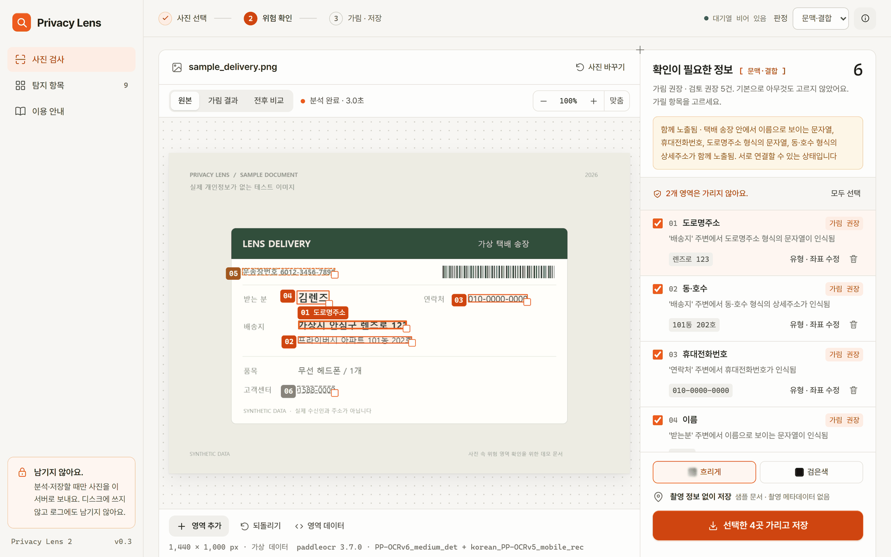
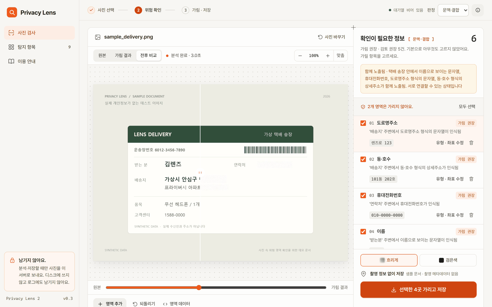
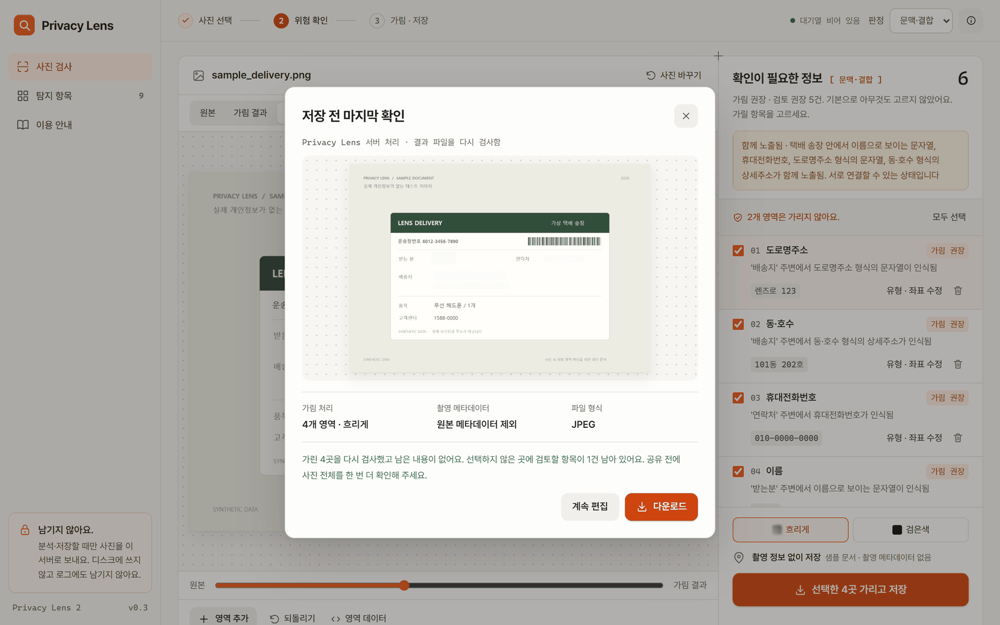
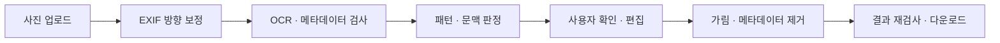

<div align="center">

# Privacy Lens

**사진을 공유하기 전, 배경 속 개인정보까지.**

택배 송장, 학생증, 모니터 화면에 담긴 개인정보를 찾아<br>
위치와 판단 근거를 보여 주고, 선택한 영역을 가린 사본을 만듭니다.


[주요 기능](#주요-기능) · [시작하기](#시작하기) · [분석 방식](#분석-방식) · [개발 안내](#개발-안내) · [문서](#문서)

수원대학교 정보보호학과 · 시스템보안프로젝트 · 2026학년도 2학기 · 5인 팀

</div>



## 주요 기능

Privacy Lens는 SNS나 중고거래에 사진을 올리기 전, 배경에 함께 찍힌 개인정보를 확인하는 웹 서비스입니다. 분석 결과를 바탕으로 사용자가 가릴 영역을 선택하고 수정할 수 있습니다.

| 기능 | 설명 |
|---|---|
| **개인정보 탐지** | 이름, 전화번호, 이메일, 주소, 주민등록번호, 카드번호, 운송장번호, 차량번호와 QR·바코드, EXIF 위치정보를 확인합니다. 이름은 라벨이 있는 경우에 탐지합니다. |
| **근거와 우선순위 표시** | 각 항목을 가림 권장·검토 권장·참고로 구분하고, 주변 문구와 함께 판단 근거를 보여 줍니다. |
| **영역 선택과 편집** | 탐지된 영역을 선택하거나 수정하고, 놓친 영역은 직접 추가할 수 있습니다. |
| **미리보기와 저장** | 서버에서 가림 처리를 적용한 결과를 미리 보여 주고, 메타데이터 제거와 결과 파일 재검사를 거쳐 사본을 제공합니다. |

### 사용 흐름

1. **사진 선택** — 사진을 올리거나 가상 정보로 만든 샘플을 선택합니다.
2. **결과 확인** — 사진에 표시된 영역과 항목별 판단 근거를 확인합니다.
3. **가릴 영역 편집** — 필요한 항목을 선택하고, 놓친 영역을 직접 지정합니다.
4. **미리보기·저장** — 흐리게 또는 검은색 가림을 적용한 결과를 확인하고 사본을 내려받습니다.

<table>
  <tr>
    <td width="50%"></td>
    <td width="50%"></td>
  </tr>
  <tr>
    <td align="center"><b>전후 비교</b><br>서버에서 가림 처리한 결과를 미리 확인합니다.</td>
    <td align="center"><b>결과 저장</b><br>재검사 결과를 확인하고 사본을 내려받습니다.</td>
  </tr>
</table>

> 탐지 결과에는 누락이 있을 수 있습니다. 저장 전 미리보기에서 사진 전체를 확인하고, 필요한 영역을 직접 추가해 주세요.

## 시작하기

기본 OCR 엔진은 PaddleOCR이며, 처음 실행할 때 모델 가중치를 내려받습니다. 아래 설치 안내는 **일반 CPython 3.10~3.13**을 기준으로 합니다. Linux용 PaddlePaddle 3.2.2 패키지는 이 범위의 `x86_64`·`aarch64` 환경에 제공되며, Python 3.14 이상이나 다른 환경에 그대로 적용할 수 없습니다. 패키지 제공 여부는 [공식 CPU 배포 목록](https://www.paddlepaddle.org.cn/packages/stable/cpu/paddlepaddle/)에서 확인할 수 있습니다.

### 설치 및 실행

```bash
git clone https://github.com/2026-usw-project/privacy-lens.git
cd privacy-lens
```

파이썬 가상환경 사용시 사용할 Python 버전을 확인하고 가상환경을 만듭니다. 다음은 **Python 3.12와 venv가 설치된 환경**의 예시입니다. 3.10·3.11·3.13을 사용한다면 첫 명령의 실행 파일 이름을 해당 버전으로 바꾸세요.

```bash
python3.12 -m venv .venv
source .venv/bin/activate
python --version
```

선택한 Python 환경에서 패키지를 설치합니다. PaddlePaddle은 저장소에서 동작을 확인한 3.2.2를 지정합니다.

```bash
python -m pip install --upgrade pip
python -m pip install -r requirements.txt
python -m pip install paddlepaddle==3.2.2 -i https://www.paddlepaddle.org.cn/packages/stable/cpu/
python -m pip install paddleocr
python run.py
```

실행 후 [http://127.0.0.1:8000](http://127.0.0.1:8000)에 접속합니다. 웹 화면과 API는 같은 주소에서 제공됩니다.

- `run.py`는 필요한 패키지, 한글 폰트와 OCR 환경을 점검합니다. 누락된 항목이 있으면 설치 방법을 안내합니다.
- 초기 준비 시간은 모델 다운로드 여부와 실행 환경에 따라 달라집니다. 화면 상단의 `OCR 엔진 준비 중` 표시가 `대기열 비어 있음`으로 바뀌면 분석을 시작할 수 있습니다.
- 화면의 샘플 3종으로 가상 송장·학생증·복합 문서의 분석 결과를 확인할 수 있습니다.
- HEIC 사진은 `pillow-heif`가 설치된 환경에서 지원합니다.

환경 점검만 실행하려면 다음 명령을 사용합니다.

```bash
python run.py --check
```

저장소에서 확인한 PaddlePaddle 3.3.x CPU 추론 오류를 피하기 위해 설치 안내는 3.2.2를 사용합니다. 설치 문제와 세부 설정은 [개발 노트](docs/DEVELOPMENT.md#빠르게-실행)를 참고하세요.

<details>
<summary><b>Linux에서 No matching distribution found가 발생할 때</b></summary>

이 오류는 pip가 현재 환경과 버전 조건에 맞는 설치 파일을 찾지 못했다는 뜻입니다. 오류 문구만으로 원인을 확정할 수 없으므로 먼저 환경을 확인합니다.

```bash
python --version
uname -m
python -m pip --version
```

- **Python 버전:** 3.14 이상이면 위에서 안내한 3.10~3.13으로 새 가상환경을 만듭니다. 기존 가상환경의 Python 버전은 pip 업그레이드로 바뀌지 않습니다.
- **CPU·배포판:** 32비트 환경이나 Alpine Linux처럼 musl을 사용하는 환경은 일반 Linux 패키지와 호환되지 않을 수 있습니다. [공식 Linux 설치 조건](https://www.paddlepaddle.org.cn/documentation/docs/en/install/pip/linux-pip_en.html)을 확인합니다.
- **패키지 저장소:** 지원 환경에서도 오류가 나면 위 설치 명령처럼 공식 CPU 인덱스를 지정합니다. 앞선 로그에 연결·인증서·프록시 오류가 있는지도 확인합니다.

설치 후 추론 엔진을 확인할 수 있습니다.

```bash
python -c "import paddle; paddle.utils.run_check()"
```

</details>

<details>
<summary><b>Tesseract로 실행하기</b></summary>

[Tesseract와 한국어 데이터](docs/DEVELOPMENT.md#tesseract-설치)를 설치한 뒤 OCR 엔진을 지정합니다.

**Windows PowerShell**

```powershell
$env:PL_OCR = "tesseract"
python run.py
```

**macOS / Linux**

```bash
PL_OCR=tesseract python run.py
```

</details>

## 분석 방식

OCR로 읽은 글자와 위치에서 개인정보 후보를 찾고, 주변 라벨과 문맥을 함께 확인합니다. 기울어진 문서는 글줄 방향을 기준으로 위치 관계를 판단합니다.



### 문맥에 따른 판정

같은 형식의 숫자라도 주변에 어떤 문구가 있는지에 따라 판정이 달라집니다. 아래는 가상 정보를 사용한 예시입니다.

| 인식한 내용 | 판정 | 판단 근거 |
|---|---|---|
| `연락처 010-1234-5678` | **가림 권장** | 같은 줄 왼쪽에 개인정보 라벨이 있습니다. |
| `고객센터 1588-0011` | 참고 | 대표번호 대역과 공개 정보 라벨에 해당합니다. |
| `배송지 ○○로 208` 다음 줄의 `101동 202호` | **가림 권장** | 다음 줄까지 이어진 배송지 정보로 판단합니다. |
| `운송장번호 6012-3456-7890` | 검토 권장 | 배송 조회에 사용될 수 있는 번호로 판단합니다. |
| 라벨 없는 `909266858784` | 참고 | 숫자만으로 정보의 종류를 확정하지 않습니다. |

결과는 **심각도와 확실성**을 구분해 표시합니다.

| 구분 | 표시 방식 | 의미 |
|---|---|---|
| 심각도 | 색상 | 가림 권장 · 검토 권장 · 참고 |
| 확실성 | 선 모양 | 실선: 내용 확인 · 파선: 일부만 인식 · 점선: 확인 불가 |

세부 판정 규칙과 처리 흐름은 [개발 노트](docs/DEVELOPMENT.md)와 [아키텍처](docs/ARCHITECTURE.md)에 정리되어 있습니다.

### 개인정보 보호 원칙

- **원본 비저장** — 사진은 분석·미리보기·저장 요청 시 서버로 전송되며 메모리에서 처리합니다. 업로드 이미지와 OCR 원문을 디스크·로그·DB에 저장하지 않습니다.
- **로컬 OCR 사용** — 서버에 설치된 OCR 엔진으로 분석하며, 사진을 외부 OCR API로 보내지 않습니다.
- **근거 중심 설명** — 읽지 못한 내용을 추정해 채우거나 신원 특정 가능성을 점수로 제시하지 않습니다. 사용자에게 표시하는 분석 문구는 `pipeline/wording.py`에서 관리합니다.
- **문서 단위 결합** — 같은 문서로 묶인 항목 안에서 함께 노출된 정보를 설명합니다. 문서 구분의 한계는 아래에 안내합니다.
- **가림 후 재검사** — ‘흐리게’는 선택 영역을 주변색으로 채운 뒤 흐림 효과를 적용합니다. 결과 파일을 다시 검사해 선택 영역의 재탐지 여부와 위치정보 제거 여부를 확인합니다.
- **QR 링크 미접속** — QR에서 읽은 문자열만 검사하고, 포함된 링크에 접속하지 않습니다.

## 측정 결과

> **합성 데이터로 측정한 개발 기록입니다.** 일부 규칙은 같은 샘플을 사용해 조정했습니다. 아래 수치는 일반적인 실사 성능을 뜻하지 않으며, 발표·보고용 성능은 개발에 사용하지 않은 실사 사진으로 다시 측정해야 합니다.

### 문맥 규칙 적용 전후

같은 사진과 OCR 엔진에서 판정 규칙만 바꾼 비교입니다. **놓침**은 가려야 할 항목 9개 중 가림 권장으로 분류하지 못한 수, **오경고**는 고객센터 번호·운송장번호 6개 중 가림 권장으로 분류한 수입니다.

| 판정 조건 | Tesseract 5.5 놓침 / 오경고 | PaddleOCR 3.7 놓침 / 오경고 |
|---|:---:|:---:|
| 정규식만 적용 | 1 / 5 | 0 / 6 |
| 심각도표 추가 | 6 / 0 | 6 / 0 |
| **문맥·결합 규칙 추가 — 기본 방식** | **4 / 0** | **0 / 0** |

PaddleOCR 수치는 `privacy-lens-2`에 포함된 원본 샘플 이미지 기준입니다. 이 저장소에서 샘플을 다시 생성하면 글꼴 차이로 기본 방식의 놓침이 1건으로 나타납니다.

<details>
<summary><b>회전 실험 결과</b></summary>

PaddleOCR로 합성 송장 6장을 0°·15°·30°·45°·60°·90°·180°·270°에서 분석한 결과입니다.

| 항목 | 화면의 가로·세로 기준 | 글줄 방향 기준 |
|---|:---:|:---:|
| 가려야 할 항목을 가림 권장으로 분류 | 92 / 144 | **131 / 144** |
| 이름 탐지 | 11 / 48 | **42 / 48** |
| 오경고 | 0 | 0 |

이 실험에서 남은 놓침은 OCR이 라벨이나 이름을 읽지 못한 경우였습니다. 별도의 30°·60° 송장 가림 실험에서는 글자 외곽선을 따라 가린 면적이 사각형 방식의 24~26%였으며, 재검사 시 선택 영역에서 읽힌 글자는 0개였습니다.

</details>

측정 방법과 각도별 결과는 [개발 노트의 비교 실험](docs/DEVELOPMENT.md#비교-실험)을 참고하세요.

## 개발 안내

### 저장소 구조

```text
privacy-lens/
├── server.py             FastAPI 서버 · API · 웹 화면 제공
├── jobqueue.py           OCR 대기열 · 순서 · 취소 · 요청 한도
├── run.py                환경 점검 및 서버 실행
├── pipeline/             OCR · 패턴 · 문맥 판정 · 가림 처리
├── web/frontend-demo/
│   ├── dist/             화면 편집 원본 (HTML · CSS · JavaScript)
│   ├── scripts/          정적 검사 · API 계약 검사 · 빌드
│   └── privacy-lens.html 서버에서 제공하는 빌드 결과물
├── eval/                 비교 실험 · 회전 실험
├── samples/              가상 정보 기반 합성 샘플 생성
├── tests/                백엔드 회귀 테스트
└── docs/                 설계 · 개발 기록 · 역할 · 결정 사항
```

**화면 편집 원본은 `web/frontend-demo/dist/`입니다.** 수정 후 빌드하면 서버가 제공하는 `privacy-lens.html`에 반영됩니다. 모듈별 역할은 [아키텍처](docs/ARCHITECTURE.md#1-구성)를 참고하세요.

### 검사 및 실험

**백엔드 테스트** — 저장소 루트에서 실행합니다. OCR 엔진은 필요하지 않습니다.

```bash
python -m pytest tests
```

**화면 검사·빌드** — 화면을 수정했다면 아래 순서로 실행합니다.

```bash
cd web/frontend-demo
node scripts/check.mjs
node scripts/check-contract.mjs
node scripts/build.mjs
```

**합성 샘플·평가** — 저장소 루트에서 실행합니다. 평가에는 OCR 엔진이 필요하며, 기본 엔진은 PaddleOCR입니다.

```bash
python samples/make_sample.py samples/out
python -m eval.compare samples/out
python -m eval.rotation
```

<details>
<summary><b>환경변수</b></summary>

| 변수 | 기본값 | 설명 |
|---|---|---|
| `PL_OCR` | `paddleocr` | OCR 엔진 선택. `tesseract` 또는 `none`으로 변경할 수 있습니다. `none`은 글자 OCR을 생략합니다. |
| `PL_PADDLE_LANG` | `korean` | PaddleOCR 인식 언어 |
| `PL_PADDLE_DET` | `PP-OCRv6_medium_det` | 검출 모델. `auto`는 PaddleOCR의 언어별 기본 모델을 사용합니다. |
| `PL_PADDLE_REC` | 언어별 기본 모델 | 한국어 기본 조합은 `korean_PP-OCRv5_mobile_rec`입니다. |
| `PL_TESSERACT` | 자동 탐색 | Tesseract 실행 파일 경로 |
| `PL_QUEUE_MAX` | `12` | 최대 대기 요청 수. 초과 시 HTTP 503을 반환합니다. |
| `PORT` | `8000` | 서버 포트 |

모델 선택과 버전별 동작은 [OCR 엔진 교체 안내](docs/DEVELOPMENT.md#ocr-엔진-교체)를 참고하세요.

</details>

<details>
<summary><b>주요 API</b></summary>

| 메서드 | 경로 | 용도 |
|---|---|---|
| `POST` | `/analyze` | 사진 분석 |
| `POST` | `/redact/preview` | 가림 처리 미리보기 |
| `POST` | `/redact` | 가림 처리 · 메타데이터 제거 · 결과 재검사 |
| `GET` | `/queue` | 대기열 상태 조회 |
| `POST` | `/queue/cancel` | 대기 요청 취소 |

요청 필드와 응답 형식은 [API 계약 문서](web/frontend-demo/API_CONTRACT.md)에 정리되어 있습니다.

</details>

### 협업 규칙

- `feat/<모듈>-<내용>` 브랜치에서 작업하고, PR에 리뷰 1인 승인을 받은 뒤 병합합니다. `main`에 직접 push하지 않습니다.
- 실사 이미지, OCR 원문, 실제 개인정보는 커밋하거나 로그에 기록하지 않습니다. 샘플과 정답에는 가상 정보만 사용합니다.
- 문서·주석·커밋 메시지는 한국어, 식별자는 영어를 사용합니다. 커밋 메시지 형식은 `type(scope): 설명`입니다.
- AI 코딩 도구를 사용하는 경우 [AGENTS.md](AGENTS.md)를 먼저 확인합니다.

## 알려진 한계

| 조건 | 현재 한계 |
|---|---|
| 작거나 흐릿한 글자 | OCR이 라벨이나 본문을 읽지 못하면 탐지 또는 문맥 판정이 누락될 수 있습니다. |
| 라벨 없는 이름 | 이름만 적힌 명찰처럼 주변 라벨이 없는 경우는 탐지하지 못합니다. |
| 글자를 읽을 수 없는 문서 | 문서·카드 모양을 찾는 검출기가 없어, OCR 결과가 없으면 영역도 제시하지 못합니다. |
| 맞닿은 문서 | 글자 간격으로 문서를 구분하므로 서로 다른 종이가 하나로 묶일 수 있습니다. |
| 여러 방향의 문서 | 한 사진에 방향이 크게 다른 문서가 섞이면 글줄 방향 추정이 일부 문서에 맞지 않을 수 있습니다. |
| 탐지되지 않은 영역 | 사용자가 직접 지정하지 않으면 저장한 사본에도 남을 수 있습니다. |

전체 한계와 개선 과제는 [개발 노트](docs/DEVELOPMENT.md#알려진-한계)에 기록되어 있습니다.

## 팀

| 역할 | 담당 범위 | 주요 산출물 |
|---|---|---|
| 1 · 데이터 구축 | 데이터 준비 · 라벨링 | 데이터셋 · 라벨링 기준서 |
| 2 · 평가·통합 지원 | 평가 · 오류 재현 · 통합 확인 | 평가 코드 · 오류 목록 · 성능 보고서 |
| 3 · AI 분석 | OCR · 개인정보 판정 | 분석 모듈 |
| 4 · 백엔드 | API · 가림 처리 · 서버 운영 | API · 보호 처리 · 배포 서버 |
| 5 · 프론트엔드 | 결과 표시 · 영역 편집 · 저장 흐름 | 웹 화면 · 영역 편집 기능 |

## 문서

| 문서 | 내용 |
|---|---|
| [개발 노트](docs/DEVELOPMENT.md) | 설치 세부 · 설계 원칙 · 판정 규칙 · 측정 기록 · 알려진 한계 |
| [아키텍처](docs/ARCHITECTURE.md) | 처리 흐름 · 모듈 구성 · API · 개인정보 보호 원칙 |
| [결정 사항](docs/DECISIONS.md) | 결정 이력 · 미결 사항 · 백엔드 교체 기록 |
| [요구사항](docs/PRD.md) | 프로젝트 목표와 요구사항 |
| [역할 분담](docs/ROLES.md) | 역할별 책임과 협업 범위 |
| [프론트엔드 안내](web/frontend-demo/README.md) | 화면 구조 · 편집 방법 · 검사와 빌드 |
| [API 계약](web/frontend-demo/API_CONTRACT.md) | 요청·응답 형식과 화면 연동 기준 |

> **문서 기준:** 2026-10-04에 백엔드를 [Privacy Lens 2](https://github.com/2026-usw-project/privacy-lens-2)로 교체하고, 화면은 `web/frontend-demo`를 유지했습니다. 요구사항·역할 문서의 일부 폴더명과 구현 전제는 교체 전 기준입니다. 변경 내역은 [결정 사항](docs/DECISIONS.md#교체로-사실상-정해진-것-2026-10-04-팀-확인-필요)을 확인하세요.

프로젝트 명칭의 공개 사용 전 확인 사항은 [개발 노트의 알려진 한계](docs/DEVELOPMENT.md#알려진-한계)에 정리되어 있습니다.
